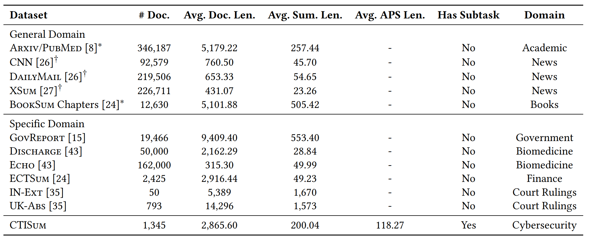

# CTISum
The new dataset and baseline models for the paper CTISum: A New Benchmark Dataset For Cyber Threat Intelligence Summarization.

The repositories include the following parts:
- The dataset files.
- The baseline models, which include llama2, bart, and xxx.
- The evaluation metrics.

## Dataset
The dataset can be divided into three parts.
- One for original source pdf files.
- One for Cyber Threat Intelligence (CTI) summarization task.
- One for Attack Process Summarization (APS) task.

The following table describes the statistics of the CTISum dataset and existing summarization datasets from different domains.

  

## Baseline model
- LLAMA2
- BART
- Longformer
- T5
- Transformer
- MatchSum
- BertSumExt

## Evaluation metrics
The automatic and human A/B evaluation, like BERTScore and ROUGE-𝑛 (R-𝑛) are taken as main evaluation metrics, which are widely used for evaluating the quality of summarization generation.

We provide in the corresponding folder:
- rouge
- bert-score

Every .py file has the corresponding running command line.

**Note: Because our paper has not been published, we sample an example in the dataset part, the rest files will be released once the paper publication. More case analyses can be seen in the paper.**

Thanks for the attention.
